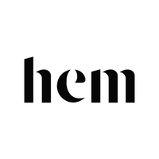
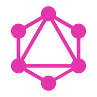
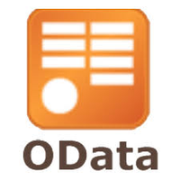
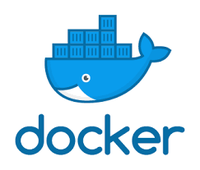
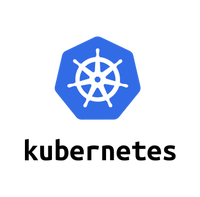
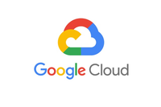
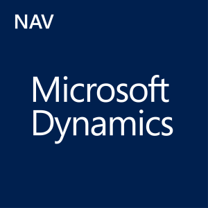

# NAV API GATEWAY

GraphQL API Gateway for Microsoft Navision Written in GO











### Prerequisites


```
go version: 1.11.4

dep version: 0.5.0
```

### Installing and running

```
clone

dep ensure

go run main.go
```

## Deployment

Deployment requires docker ...

## Built With

* [go](https://golang.org/) - Golang Programming Language
* [dep](https://github.com/golang/dep) - Dependency Management Tool
* [graphql-go](https://github.com/graphql-go/graphql) - Graphql Library for Go


## Documentation for Go Code is hosted here
[https://hemdesignstudio.github.io/nav_api_gateway/](https://hemdesignstudio.github.io/nav_api_gateway/)

## Authors

* **Ahmed Nafies** 
## License

This project is licensed under the Proprietary License - see the [LICENSE.md](LICENSE.md) file for details
